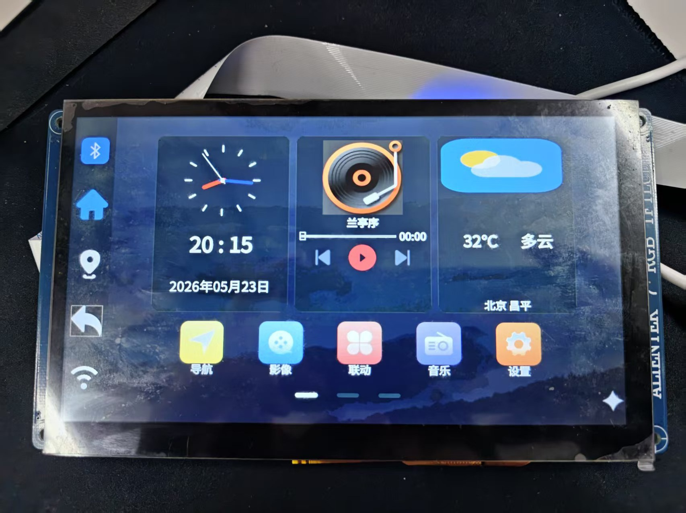
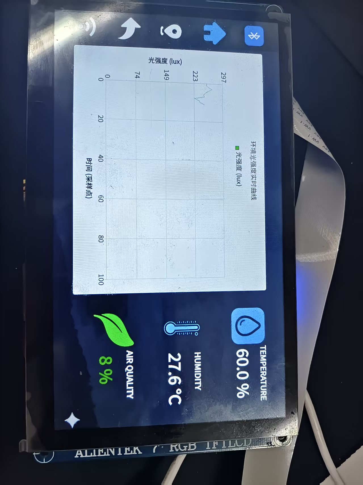
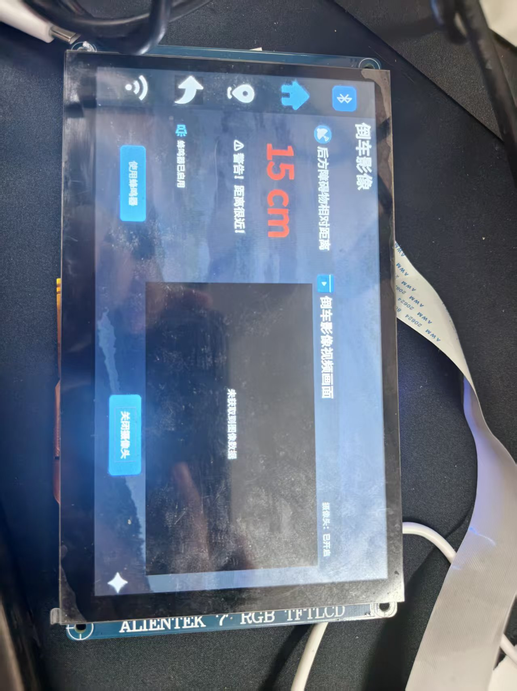

# i.MX6ULL-Based In-Vehicle Intelligent Terminal System

基于 NXP i.MX6ULL 和嵌入式 Linux 开发的车载智能终端系统。项目采用 Qt 构建图形化交互界面，集成 USB 摄像头、超声波测距、网络天气查询、车辆状态显示及多媒体等功能。

# 🚗 嵌入式智能车载信息娱乐系统

> 基于 **ARM Linux + Qt 5 / C++** 的智能车载信息娱乐系统，集成环境感知、倒车影像、超声波泊车辅助、在线天气、GPS 地图导航、多媒体娱乐等核心功能模块。

---

## 📸 系统概览

<div align="center">

| 系统主界面 | 环境监测 | 倒车影像 & 测距 |
|:---:|:---:|:---:|
|  |  |  |

</div>

---

## 📋 目录

- [功能模块](#-功能模块)
- [技术栈](#-技术栈)
- [硬件平台](#-硬件平台)
- [项目架构](#-项目架构)
- [编译与运行](#-编译与运行)
- [核心代码解析](#-核心代码解析)
- [优化与创新点](#-优化与创新点)

---

## 🧩 功能模块

### 1. 🌡️ 车载环境监测模块

基于 I2C 总线驱动多类传感器，实现车内环境实时采集与可视化：

| 传感器 | 型号 | 采集数据 | 通信接口 |
|--------|------|----------|----------|
| 空气质量传感器 | MQ-135 | 有害气体浓度 | I2C |
| 温湿度传感器 | DHT11 | 温度 + 湿度 | I2C |
| 三合一环境光传感器 | AP3216C | ALS 光照 + PS 接近 + IR 红外 | I2C |

**核心特性**：
- **EWMA 滤波**：指数加权移动平均算法抑制传感器噪声
- **体感温度**：结合温度与相对湿度计算 Heat Index
- **分级预警**：根据有害气体浓度百分比变色显示（绿→橙→红）
- **异常自诊断**：连续读取失败自动标记传感器故障

> 📂 代码位置：[`environment/environment.cpp`](environment/environment.cpp)

### 2. 📷 倒车影像与泊车辅助模块

通过 **V4L2** 框架驱动 USB 摄像头，结合 **HC-SR04 超声波传感器** 实现倒车影像与距离检测。

**摄像头采集**（参考 [`camera/camera.cpp`](camera/camera.cpp)）：

```cpp
// 多格式自适应匹配 —— camera/camera.cpp:66-71
// 按优先级匹配摄像头输出格式: YUYV > RGB565 > MJPEG > RGB24
unsigned int preferred[] = {
    V4L2_PIX_FMT_YUYV,      // 优先 YUYV，软转换为 RGB
    V4L2_PIX_FMT_RGB565,    // 次选 RGB565
    V4L2_PIX_FMT_MJPEG,     // MJPEG 压缩格式
    V4L2_PIX_FMT_RGB24      // 最后 RGB24
};
```

**YUYV → RGB 色彩空间转换**（[`camera/camera.cpp:227-256`](camera/camera.cpp#L227-L256)）：
- 基于**整数乘加**的定点运算替代浮点运算
- 使用 clamp 函数进行溢出保护
- 专为 ARM 嵌入式平台优化

**HC-SR04 超声波测距**（[`camera/camera.cpp:300-344`](camera/camera.cpp#L300-L344)）：

```cpp
// HCSR04Thread::run() —— camera/camera.cpp:309
// 通过 /dev/sr04 设备节点读取超声波传感器数据
fd = open("/dev/sr04", O_RDWR);
// 发送 ioctl 触发测量 → 读取纳秒级时间 → 换算为厘米距离
ioctl(fd, CMD_TRIG);
read(fd, &val, 4);
int distance = (int)((unsigned int)val * 340LL / 2 / 1000000);
```

**三级声光报警**（[`camera/camera.cpp:476-521`](camera/camera.cpp#L476-L521)）：

| 距离范围 | 显示颜色 | 告警提示 | 蜂鸣器 |
|----------|----------|----------|--------|
| < 10 cm | 🔴 红色 `#ff4444` | ⚠️ 危险！距离过近！请停车！ | 蜂鸣 |
| 10–20 cm | 🔴 红色 `#ff4444` | ⚠️ 警告！距离很近！ | — |
| 20–30 cm | 🔴 红色 `#ff4444` | ⚠️ 注意！距离较近 | — |
| 30–100 cm | 🟠 橙色 `#ffa500` | 距离较近，请注意 | — |
| ≥ 100 cm | 🟢 绿色 `#00ff00` | ✓ 距离安全 | — |

### 3. 🌤️ 在线天气服务模块

调用开放天气 API，解析 JSON 数据，展示实时天气与多日预报：

- **5 日温度趋势折线图**：QPainter 自绘实现
- **省市二级联动城市选择器**：动态加载城市编码
- **丰富气象指标**：温度、湿度、风向风力、PM2.5、紫外线指数等
- **本地缓存**：天气数据 5 分钟有效期内复用缓存

> 📂 代码位置：[`weather/weather.cpp`](weather/weather.cpp)

### 4. 🗺️ GPS 地图导航模块

集成百度地图开放平台 API，实现定位与导航功能：

- **GPS 实时定位**：解析 `$GNRMC` NMEA 协议报文
- **坐标纠偏**：WGS-84 → BD-09 坐标系转换
- **正向地理编码**：地址 → 经纬度坐标
- **驾车路径规划**：起点/终点之间的导航路线
- **静态地图渲染**：瓦片下载与缓存，支持拖拽平移、3–19 级缩放

> 📂 代码位置：[`map/map.cpp`](map/map.cpp)、[`map/gps.cpp`](map/gps.cpp)

### 5. 🎵 车载多媒体娱乐模块

**音乐播放器**（[`music/musicplayer.cpp`](music/musicplayer.cpp)）：

- 支持 MP3 / WAV 格式，媒体库自动扫描
- LRC 歌词同步解析与滚动高亮
- 四种播放模式：列表循环 / 单曲循环 / 随机播放 / 顺序播放
- 收藏标记、音量飞梭控制
- **黑胶唱片旋转动画**：QPropertyAnimation 驱动

**视频播放器**（[`video/video.cpp`](video/video.cpp)）：

- 支持 MP4 / MKV / WMV / AVI 多格式
- 播放列表管理
- 控制栏 10 秒无操作自动隐藏

### 6. ⚙️ 系统辅助模块

| 模块 | 功能 | 代码位置 |
|------|------|----------|
| 🕐 模拟时钟 | QPainter 自绘指针式时钟 + NTP 网络授时 | [`time/analogclock.cpp`](time/analogclock.cpp) |
| 📶 Wi-Fi 设置 | SSID 扫描 + wpa_supplicant 连接 + 虚拟键盘 | [`wifi/wifi.cpp`](wifi/wifi.cpp) |
| 🏎️ 车速仪表盘 | QPainter 自绘表盘，指针动画 | [`app/speedmeter.cpp`](app/speedmeter.cpp) |
| 🖥️ 背光调节 | PWM 背光亮度控制 | [`setting/setting.cpp`](setting/setting.cpp) |
| 🔄 页面切换 | 手势滑动 + QPropertyAnimation 平移动画 | [`widget.cpp`](widget.cpp) |

---

## 🛠️ 技术栈

| 层级 | 技术 |
|------|------|
| **编程语言** | C++11 |
| **UI 框架** | Qt 5 Widgets |
| **编译器** | GCC (ARM 交叉编译 + x86 PC 端) |
| **操作系统** | ARM Linux (I.MX6U) / Ubuntu Desktop |
| **构建系统** | qmake |
| **视频采集** | V4L2 (Video4Linux2) |
| **传感器总线** | I2C |
| **网络协议** | HTTP/HTTPS、NTP、TCP/UDP |
| **地图服务** | 百度地图开放平台 API |
| **多媒体** | QMediaPlayer、QMediaPlaylist |
| **数据解析** | JSON (QJsonDocument)、NMEA 0183 |
| **并发模型** | QThread + 信号槽 + QMutex + QAtomicInt |

---

## 🔧 硬件平台

| 组件 | 型号/规格 |
|------|-----------|
| **主控芯片** | NXP I.MX6U (ARM Cortex-A7) |
| **USB 摄像头** | 通用 UVC USB Camera |
| **超声波传感器** | HC-SR04 |
| **空气质量传感器** | MQ-135 |
| **温湿度传感器** | DHT11 |
| **环境光传感器** | AP3216C (ALS + PS + IR) |
| **蜂鸣器** | 板载有源蜂鸣器 |
| **网络** | Wi-Fi / 以太网 |

---

## 📁 项目架构

```
CarSystem/
├── main.cpp                    # 程序入口
├── widget.cpp / widget.h       # 主窗口（QStackedWidget 页面管理 + 手势滑动）
├── CarSystem.pro               # Qt 工程文件
│
├── camera/                     # 📷 倒车影像 + 超声波测距
│   ├── camera.cpp              #    V4L2 采集 + HC-SR04 测距 + 蜂鸣器报警
│   ├── camera.h                #    CaptureThread / HCSR04Thread / Camera
│   └── camera.ui               #    摄像头 UI 布局
│
├── environment/                # 🌡️ 环境监测
│   ├── environment.cpp         #    MQ-135 / DHT11 / AP3216C 传感器采集
│   ├── environment.h
│   └── environment.ui
│
├── weather/                    # 🌤️ 天气服务
│   ├── weather.cpp / .h        #    天气 API 请求与界面
│   ├── day.cpp / .h            #    单日天气数据结构
│   └── weather.ui
│
├── map/                        # 🗺️ GPS 地图导航
│   ├── map.cpp / .h            #    百度地图集成
│   ├── gps.cpp / .h            #    GPS NMEA 解析
│   └── map.ui
│
├── music/                      # 🎵 音乐播放器
│   ├── musicplayer.cpp / .h    #    音频播放 + LRC 歌词
│   ├── rotatablelabel.cpp / .h #    黑胶旋转动画
│   └── musicplayer.ui
│
├── video/                      # 🎬 视频播放器
│   ├── video.cpp / .h
│   └── video.ui
│
├── app/                        # 🏎️ 车速仪表盘
│   ├── speedmeter.cpp / .h
│   └── speedmeter.ui
│
├── time/                       # 🕐 时钟模块
│   ├── analogclock.cpp / .h    #    模拟时钟
│   ├── gps.cpp / .h            #    GPS 时间同步
│   └── networktimemanager.cpp/.h #  NTP 网络授时
│
├── wifi/                       # 📶 Wi-Fi 管理
│   ├── wifi.cpp / .h
│   └── wifi.ui
│
├── setting/                    # ⚙️ 系统设置
│   ├── setting.cpp / .h
│   └── setting.ui
│
├── citycodeutils.cpp / .h      # 城市编码工具（天气城市选择器）
│
└── docs/images/                # 📸 截图
    ├── overview.jpg            #    系统主界面
    ├── environment.jpg         #    环境监测界面
    └── Distance.jpg            #    倒车影像与测距界面
```

---

## 🚀 编译与运行

### 环境要求

- **Qt 5.12** 或更高版本
- **GCC** 支持 C++11
- ARM 交叉编译工具链（板端部署）
- Linux Kernel 头文件（V4L2 / I2C 驱动开发）

### PC 端编译（仿真调试）

```bash
cd CarSystem
qmake CarSystem.pro
make -j$(nproc)
./CarSystem
```

### ARM 板端交叉编译

```bash
cd CarSystem
# 使用 ARM 交叉编译工具链的 qmake
/path/to/arm-qt5-qmake CarSystem.pro
make -j$(nproc)
# 部署到开发板
scp CarSystem root@<board-ip>:/opt/CarSystem/bin/
```

> **双环境适配**：工程通过 `IS_BOARD_ENV` / `IS_PC_ENV` 编译宏实现硬件抽象层，PC 端自动使用模拟数据回退，ARM 端访问真实传感器与设备节点。

### 设备节点依赖（板端）

| 设备节点 | 用途 | 对应模块 |
|----------|------|----------|
| `/dev/video2` | USB 摄像头 | 倒车影像 |
| `/dev/sr04` | HC-SR04 超声波传感器 | 泊车测距 |
| `/sys/class/leds/beep/brightness` | 蜂鸣器控制 | 倒车报警 |
| `/sys/bus/i2c/...` | I2C 传感器 | 环境监测 |

---

## 💻 核心代码解析

### V4L2 视频采集流程

参考 [`camera/camera.cpp:28-295`](camera/camera.cpp#L28-L295)，完整的 V4L2 采集流水线：

```cpp
// 1. 打开设备 (camera.cpp:41-46)
video_fd = open(VIDEO_DEVICE, O_RDWR | O_NONBLOCK);

// 2. 枚举支持的格式 (camera.cpp:49-63)
while (ioctl(video_fd, VIDIOC_ENUM_FMT, &fmtdesc) == 0) { ... }

// 3. 按优先级匹配格式 (camera.cpp:66-90)
//    优先级: YUYV > RGB565 > MJPEG > RGB24

// 4. 设置视频格式 (camera.cpp:93-103)
ioctl(video_fd, VIDIOC_S_FMT, &fmt);

// 5. 请求缓冲区 (camera.cpp:110-121)
ioctl(video_fd, VIDIOC_REQBUFS, &req_bufs);

// 6. MMAP 内存映射 (camera.cpp:124-147)
bufs_info[n_buf].start = mmap(NULL, buf.length, PROT_READ | PROT_WRITE,
                               MAP_SHARED, video_fd, buf.m.offset);

// 7. 缓冲区入队 + 开启流 (camera.cpp:149-171)
ioctl(video_fd, VIDIOC_QBUF, &buf);    // 入队
ioctl(video_fd, VIDIOC_STREAMON, &type); // 开流

// 8. 采集循环 (camera.cpp:175-281)
while (startFlag.load()) {
    select(video_fd + 1, &fds, NULL, NULL, &tv); // 等待帧就绪
    ioctl(video_fd, VIDIOC_DQBUF, &buf);          // 出队一帧
    // ... 格式转换 → emit imageReady(qImage) ... //
    ioctl(video_fd, VIDIOC_QBUF, &buf);           // 重新入队
}

// 9. 资源释放 (camera.cpp:284-295)
ioctl(video_fd, VIDIOC_STREAMOFF, &type);
munmap(...); close(video_fd);
```

### 双线程异步架构

```
┌─────────────────────┐     ┌──────────────────────┐
│   CaptureThread     │     │   HCSR04Thread        │
│   (V4L2 帧采集)     │     │   (超声波测距 0.5s)    │
│                     │     │                       │
│  select() 等待帧    │     │  ioctl(CMD_TRIG)      │
│  VIDIOC_DQBUF 出队  │     │  read() 读取距离       │
│  YUYV→RGB 转换      │     │  距离换算(cm)          │
└────────┬────────────┘     └──────────┬────────────┘
         │                             │
         │ signal: imageReady()        │ signal: distanceReady()
         ▼                             ▼
┌──────────────────────────────────────────────────┐
│                   Main Thread (UI)                │
│  ┌─────────────┐  ┌──────────────┐  ┌──────────┐ │
│  │ showImage() │  │ updateDist.. │  │ buzzer   │ │
│  │ QPainter    │  │ 分段变色显示  │  │ 蜂鸣器    │ │
│  │ 绘制帧      │  │ + 声光报警   │  │ 控制      │ │
│  └─────────────┘  └──────────────┘  └──────────┘ │
│              QMutex 保护共享图像缓冲区             │
└──────────────────────────────────────────────────┘
```

### 页面滑动动画

主窗口 [`widget.cpp`](widget.cpp) 通过 `QStackedWidget` + `QParallelAnimationGroup` 实现手势驱动的平滑页面切换：

- **手势捕获**：`mousePressEvent` / `mouseReleaseEvent` 计算拖拽向量
- **阈值判向**：水平滑动超过阈值触发翻页
- **并行动画组**：当前页滑出 + 目标页滑入，OutCubic 缓动曲线
- **动画对象复用**：首次创建后缓存，避免重复堆分配

---

## ✨ 优化与创新点

### 1. 多传感器融合的环境自适应

将 MQ-135、DHT11、AP3216C 三类异构传感器数据融合分析，采用 **EWMA 滤波** 抑制噪声，结合温湿度计算**体感温度 (Heat Index)**，并实现传感器异常自诊断。

### 2. YUV 色彩空间快速转换

针对 ARM 平台优化的 **整数定点运算** YUYV→RGB 转换算法，替代传统浮点运算，减少 CPU 占用。同时实现 MJPEG → Qt 原生解码的零拷贝路径。

### 3. 双线程异步采集架构

V4L2 帧采集与 HC-SR04 测距封装为独立工作线程，**信号-槽跨线程通信** + **QMutex 保护共享数据**，页面不可见时自动暂停采集降低功耗。

### 4. 多层级网络容错

三级容错机制：**指数退避重试** (1s→2s→4s) → **请求超时断开** (15s) → **本地缓存降级**，保证离线可用。

### 5. 跨平台双环境编译

`IS_BOARD_ENV` / `IS_PC_ENV` 条件编译宏实现硬件抽象层，一套代码同时支持 PC 仿真开发与 ARM 板端部署。

### 6. 手势滑动与动画引擎复用

手势驱动的页面滑动导航 + 动画面向对象缓存复用，优化嵌入式场景下的响应延迟与内存碎片。

> 📄 详细分析见 [`PROJECT_DESCRIPTION.md`](PROJECT_DESCRIPTION.md) 和 [`INNOVATIONS.md`](INNOVATIONS.md)

---

## 📊 项目信息

| 项目 | 详情 |
|------|------|
| **开发环境** | Qt 5.12.9 + GCC |
| **目标平台** | ARM Linux (I.MX6U) / Ubuntu Desktop |
| **编程语言** | C++ (C++11) |
| **构建系统** | qmake |
| **版本控制** | Git |

---

## 📄 关键词

`嵌入式 Linux` `Qt/C++` `车载信息娱乐系统` `I2C 传感器` `V4L2 视频采集` `HC-SR04 超声波测距` `百度地图 API` `GPS 定位` `多媒体播放` `NTP 网络授时` `YUYV 色彩空间转换` `MMAP 内存映射`

---

*README 生成于 2026-07 &copy; CarSystem Project*

